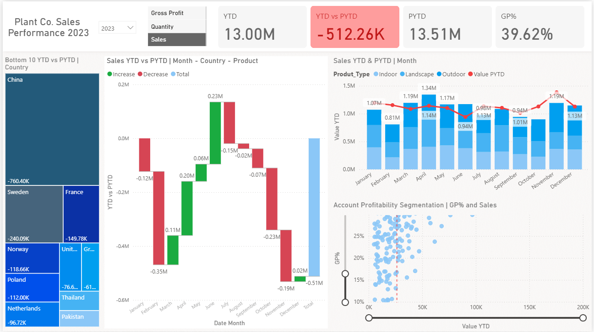

# Plant Co. Sales Performance Dashboard 2023 (Power BI)

## Project Overview

This project presents an interactive Power BI dashboard developed to analyze the sales performance of Plant Co. for the year 2023. The dashboard provides a comprehensive view of revenue trends, profitability, and regional performance, enabling data-driven decision-making.

The goal of this project is to transform raw sales data into meaningful insights that support business analysis and strategic planning.

---

## Key Insights

* Total Year-to-Date (YTD) Sales reached **13.00M**
* Previous Year-to-Date (PYTD) Sales were **13.51M**, reflecting a decline of **-512.26K**
* Gross Profit Margin (GP%) stands at **39.62%**
* Monthly sales trends show noticeable fluctuations
* Several countries contributed to negative performance, including China, Sweden, and France
* Product categories (Indoor, Landscape, Outdoor) show varying contributions
* Customer segmentation highlights differences in profitability and revenue distribution

---

## Dashboard Features

* KPI indicators for YTD, PYTD, variance, and GP%
* Waterfall chart to visualize monthly increases and decreases
* Time-series analysis of monthly sales trends
* Country-level performance breakdown
* Product category analysis (Indoor, Landscape, Outdoor)
* Profitability segmentation using scatter plot
* Interactive filters for:

  * Year selection
  * Metrics (Sales, Quantity, Gross Profit)

---

## Tools & Technologies

* Power BI – Dashboard development and visualization
* Power Query – Data cleaning and transformation
* DAX (Data Analysis Expressions) – Measures and calculations
* Excel / CSV – Data source

---

## Project Structure

Plant-Co-Sales-Dashboard
├── Plant Co. Sales Performance Report 2023.pbix
├── Plant_DTS(DATASET)
├──  Dashboard.png

└── README.md

---

## Dashboard Preview

   

---

## Business Value

This dashboard enables stakeholders to monitor key performance indicators, identify trends, and evaluate business performance across regions and product categories. It supports informed decision-making by highlighting areas of concern and opportunities for growth.

---

## Key Skills Demonstrated

* Data Visualization and Dashboard Design
* Sales and Profitability Analysis
* Time-Series Analysis
* Data Modeling using DAX
* Business Insight Generation

---

## How to Use

1. Download the `.pbix` file from the repository
2. Open it using Power BI Desktop
3. Use filters and slicers to explore different views
4. Analyze KPIs and visualizations for insights

---

## Connect with Me

I am open to internship opportunities, collaborations, and professional discussions in Data Analytics.

LinkedIn: https:https://www.linkedin.com/in/hidayat-ullah-5060743b6/
GitHub: https://github.com/your-username

---

## Tags

Power BI, Data Analytics, Dashboard, Business Intelligence, Sales Analysis
